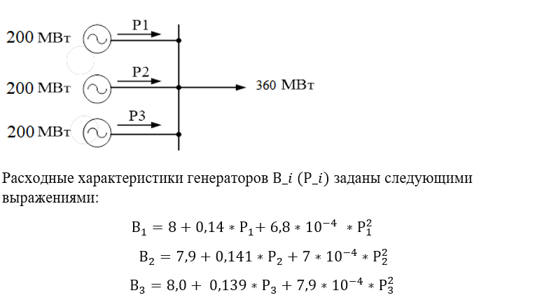

# generator_optimization_problem
Generator optimization problem solved 
Нахождение оптимальных мощностей для каждого из трех генераторов, зная функцию потребления топлива ( которую мы стремимся минизировать)
Оптимизационная задача для для моего курсового проекта по предмету "Оптимизация электроэнергетических систем (КП)" 

